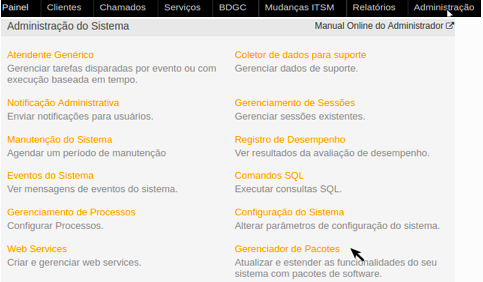
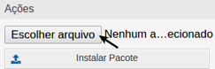
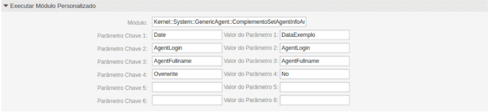

## Track Agent Actions

## O que este AddOn faz

Agrega ao atende genérico a funcionalidade de preencher campos dinâmicos com a informação do login do usuário, nome completo e data.

## Funções do Módulo 

O módulo permite que o atendente genérico faça modificações na hora da execução do messmo em determinado comapos.  
O módulo preenche os campos com as seguintes informações:

- Data da chamada do atendente generico;
- Login do proprietário do chamado;
- Nome completo do usuário;

## Pré Requisitos 

Este módulo necessita de um atendente genérico que será quem irá executar o módulo. E também dos campos dinâmicos estarem cadastrados.

## Intalação do Módulo 

Clique no botão **Administração**, e então, acesse apção **Gerenciadorde Pacotes** localizada no bloco Administração de Sistema.

O sistema irá abrir o erenciador de Pacotes, em que é possível instalar add-ons. Para isso clique no batão **Escolher Arquivos**, localizado no bloco Ações.

Selecione o pacote opm e então clique em **Istalar Pacote**.

## Configuração dos Parâmetros

Para executarmos o módulo que faz o auto preenchimento de informções é necessário passar o caminho do módulo onde ele se encontra, então a primeira informação a ser passada no campo Módulo é **Kernel::System::GenericAgent::ComplementoSetAgentInfoAndDateFields**.  
Nos campos seguintes devemos passar os parâmetros (informações que o módulo necessita para funcionar).  
Os parâmetros esperados e seus respectivos valores devem ser preenchidos na frente de cada um.  
A seguir um exemplo de cadastro válido e uma explicação de cada parâmetro a ser passado.

**Parâmtro Chave 1**: Date  
**Valor do Parâmetro 1**: DataExemplo  
**Explicação**: Deve ser passado um campo dinâmico do tipo chamado e datatime para armazenar a data de mudança.  

**Parâmetro Chave 2**: AgentLogin  
**Valor do Parâmetro 2**: AgentLogin
**Explicação**: Deve ser passado um campo dinâmico do tipo chamado e texto para armazenar o login do usuário.  

**Parâmetro Chave 3**: AgentLogin
**Valor Parâmetro 3**: AgentFullname  
**Explicação**: Deve ser passado um campo dinâmico do tipo chamado e texto para armazenar o nome competo.

**Parâmetro Chave 4**: Overwrite  
**Valor Parâmtro 4**: No  
**Explicação:** Deve ser passado um valor "sim" ou  "não" para subscrever as informações.

